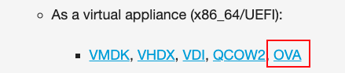
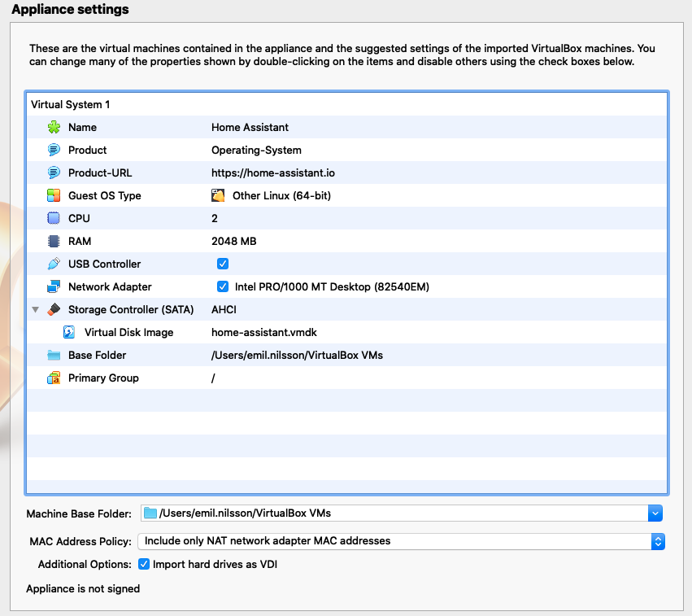
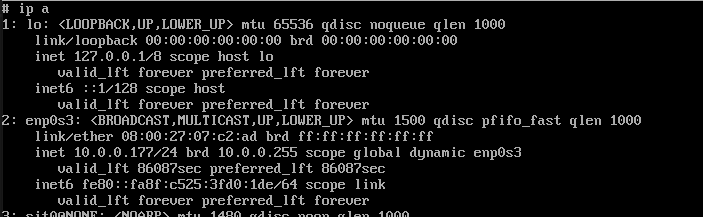

# Introduktion till Internet of Things

## Installation Home Assistant (VirtualBox)

### 1. Installation av VirtualBox

* Ladda ner VirtualBox (https://www.virtualbox.org/) och installera.

### 2. Ladda ner Home Assistant OVA

* Gå till https://www.home-assistant.io/hassio/installation/
* Ladda ner OVA avbildning. 

### 3. Importera OVA till VirtualBox

* Dubbel-klicka på hassos_ova-x.xx.ova för att starta importen.
* Välj en plats att importera virtuella maskinen.
* Säkerställ att Nätverket är anslutet.



* Rätta till eventuella konfigurations problem. (I osx kan det va problem med Video inställningar samt USB).
* Starta den virtuella maskinen.

### 4. Första start
Vid första start kommer det ta upp till 20 min för systemet att ladda ner alla komponenter.

När du ser meddelandet ``` Welcome to Home assistant ``` i terminal fönstret kan du logga in som ``` root ```.

### 5. Ta reda på IP address
Efter du har loggat in har du tillgång till Home assistant core.
För att ta reda på vilken IP adress som tilldelats till Home assistant core skriver du:

```

ha > login
# ip a

```

Nätverks gränsnsittet borde ligga högt upp i listan. I mitt fall ``` 10.0.0.177 ```



### 6. Öppna Home assistant gränssnittet
Öppna Chrome (Rekommenderas) och surfa till IP addressen från steget ovan på port 8123.

``` http://10.0.0.177:8123 ```
