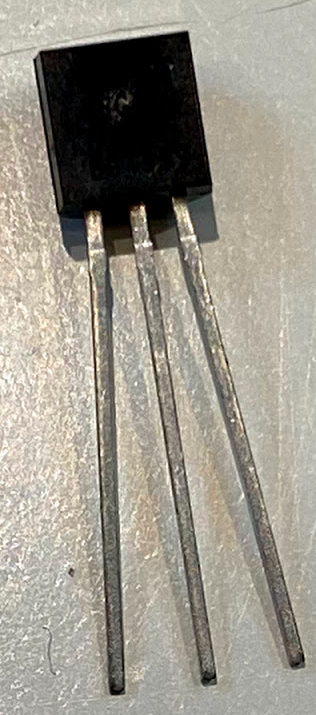
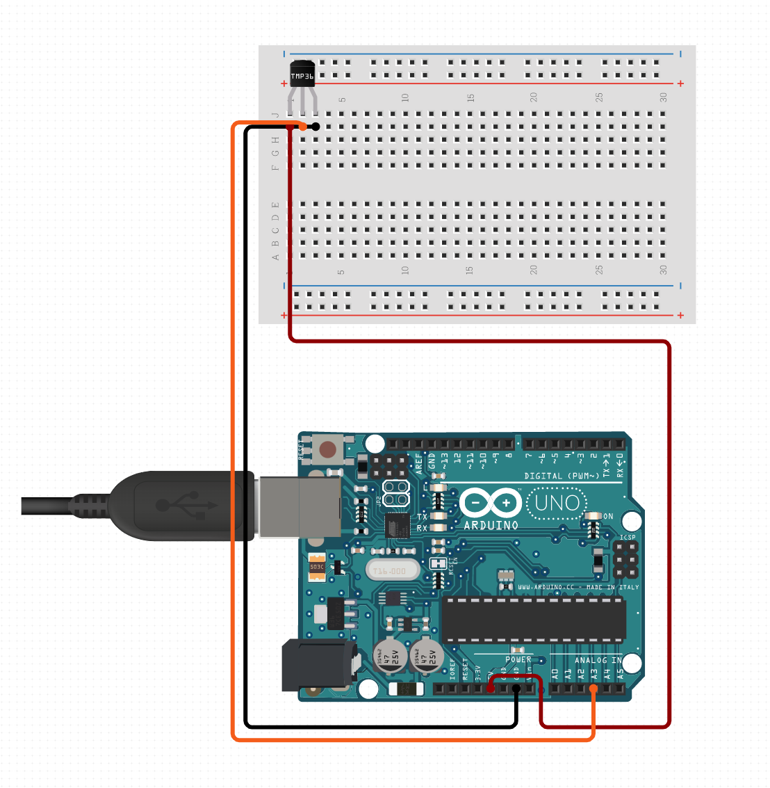
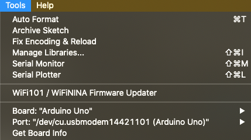

# Introduktion till Internet of Things

## Uppsättning Arduino sensor

### 1. Installation Arduino IDE

Gå till https://www.arduino.cc/en/Main/Software och ladda ner Arduino IDE

### 2. Förbered hårdvaran

För denna LAB så skall vi använda oss av Arduino UNO samt TMP36, Temperatur sensor.

1. Packa upp Arduino och montera tillsammans med kopplingsplattan.
2. Placera TMP36 sensorn på kopplingsplattan med den runda sidan bort från Arduino.



3. Koppla Vänstra benet på TMP36 till 5V, Mitten benet till A3 och Högra benet till GND.



### 3. Starta Arduino IDE och anslut Arduino

1. Starta Arduino IDE och anslut Arduino med USB
2. Kontrollera att Arduino IDE ser din Arduino
    * Gå till Tools > Board och Säkerställ att Arduino UNO är vald
    * Gå till Tools > Port och säkerställ att din Arduino är vald


### 4. Första Exempel

Skriv in följande kod i Arduino IDE

```c

void setup() {
  Serial.begin(9600); //Open serial connection
}

void loop() {
  
  int sensorVal = analogRead(A3); //Read value from analog ping A3
  float voltage = (sensorVal/1024.0) * 5.0; //Calculate voltage
  float temperature = (voltage - 0.5) * 100; //Calculate temperature
  Serial.println(temperature); // Write temperature to serial connection
  delay(100); // Wait for 100 ms
}

```

Öppna sedan ``` Serial monitor ``` för att titta på resultatet.  
Tools > Serial monitor.

